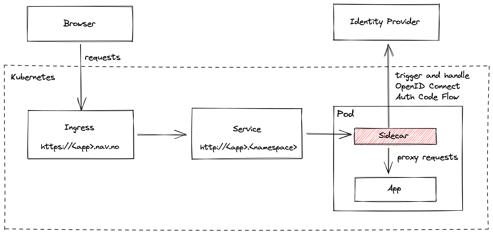
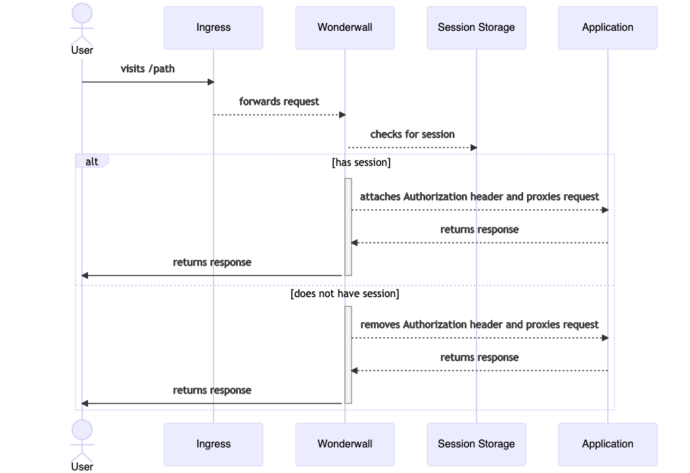

# wonderwall


`wonderwall` is an application that implements an _OpenID Connect_ (OIDC) relying party/client in a way that makes it 
easy to plug into Kubernetes as a sidecar. As such, this is OIDC as a sidecar, or OaaS, or to explain the joke: 
Oasis - Wonderwall

## Features

Wonderwall aims to be compliant with OAuth 2.1, and supports the following:

- OpenID Connect Authorization Code Flow with mandatory use of PKCE, state and nonce
- Client authentication using client assertions (`private_key_jwt`) as
  per [RFC 7523, Section 2.2](https://datatracker.ietf.org/doc/html/rfc7523).
- [RP-initiated logout](https://openid.net/specs/openid-connect-rpinitiated-1_0.html).
- [Front-channel logout](https://openid.net/specs/openid-connect-frontchannel-1_0.html).

Wonderwall functions as an optionally intercepting reverse proxy that proxies requests to a downstream host.

By default, it does not actually intercept any requests other than to remove the `Authorization` header if the user
agent does not have a valid session with Wonderwall.

## Overview

The image below shows the overall architecture of an application when using Wonderwall as a sidecar:



The sequence diagram below shows the default behavior of Wonderwall:



Generally speaking, the recommended approach when using the Wonderwall sidecar is to put it in front of
your backend-for-frontend server that serves your frontend. Otherwise, you might run into issues with the cookie
configuration and allowed redirects - these are both effectively restricted to only match the domain and path for your
application's ingress.

## Endpoints

Wonderwall exposes and owns these endpoints (which means they will never be proxied downstream):

| Path                          | Description                                                                                |
|-------------------------------|--------------------------------------------------------------------------------------------|
| `/oauth2/login`               | Initiates the OpenID Connect Authorization Code flow                                       |
| `/oauth2/callback`            | Handles the callback from the identity provider                                            |
| `/oauth2/logout`              | Initiates local and global/single-logout                                                   |
| `/oauth2/logout/frontchannel` | Handles global logout request (initiated by identity provider on behalf of another client) |

## Usage

If the user does _not_ have a valid local session with the sidecar, the request will be proxied as-is without
modifications to the upstream host.

In order to obtain a local session, the user must be redirected to the `/oauth2/login` endpoint, which performs the
OpenID Connect Authorization Code Flow.

If the user successfully completed the login flow, the sidecar creates and stores a session. A corresponding session 
cookie is created and set before finally redirecting user agent to the application. All requests that 
are forwarded to the application container will now contain an `Authorization` header with the user's `access_token`
as a Bearer token.

Do note that cookies are set for the most specific subdomain and path (if any) defined in the `ingress` configuration
variable.

### Configuration

Wonderwall can be configured using either command-line flags or equivalent environment variables (i.e. `-`, `.` -> `_`
and uppercase), with `WONDERWALL_` as prefix. E.g.:

```text
openid.client-id -> WONDERWALL_OPENID_CLIENT_ID
```

The following flags are available:

```shell
--auto-login                                       Automatically redirect user to login if the user does not have a valid session for all proxied downstream requests.
--bind-address string                              Listen address for public connections. (default "127.0.0.1:3000")
--encryption-key string                            Base64 encoded 256-bit cookie encryption key; must be identical in instances that share session store.
--error-redirect-uri string                        URI to redirect user to on errors for custom error handling.
--features.loginstatus.cookie-domain string        The domain that the cookie should be set for.
--features.loginstatus.cookie-name string          The name of the cookie.
--features.loginstatus.enabled                     Feature toggle for Loginstatus, a separate service that should provide an opaque token to indicate that a user has been authenticated previously, e.g. by another application in another subdomain.
--features.loginstatus.resource-indicator string   The resource indicator that should be included in the authorization request to get an audience-restricted token that Loginstatus accepts. Empty means no resource indicator.
--features.loginstatus.token-url string            The URL to the Loginstatus service that returns an opaque token.
--ingress string                                   Ingress used to access the main application.
--log-format string                                Log format, either 'json' or 'text'. (default "json")
--log-level string                                 Logging verbosity level. (default "debug")
--metrics-bind-address string                      Listen address for metrics only. (default "127.0.0.1:3001")
--openid.acr-values string                         Space separated string that configures the default security level (acr_values) parameter for authorization requests.
--openid.client-id string                          Client ID for the OpenID client.
--openid.client-jwk string                         JWK containing the private key for the OpenID client in string format.
--openid.post-logout-redirect-uri string           URI for redirecting the user after successful logout at the Identity Provider.
--openid.provider string                           Provider configuration to load and use, either 'openid', 'azure', 'idporten'. (default "openid")
--openid.scopes strings                            List of additional scopes (other than 'openid') that should be used during the login flow.
--openid.ui-locales string                         Space-separated string that configures the default UI locale (ui_locales) parameter for OAuth2 consent screen.
--openid.well-known-url string                     URI to the well-known OpenID Configuration metadata document.
--redis.address string                             Address of Redis. An empty value will use in-memory session storage.
--redis.password string                            Password for Redis.
--redis.tls                                        Whether or not to use TLS for connecting to Redis. (default true)
--redis.username string                            Username for Redis.
--session-max-lifetime duration                    Max lifetime for user sessions. (default 1h0m0s)
--upstream-host string                             Address of upstream host. (default "127.0.0.1:8080")
```

At minimum, the following configuration must be provided:

- `openid.client-id`
- `openid.client-jwk`
- `openid.well-known-url`
- `ingress`

#### ID-porten

When the `openid.provider` flag is set to `idporten`, the following environment variables are bound to the required `openid`
flags described previously:

- `IDPORTEN_CLIENT_ID`  
  Client ID for the client at ID-porten.
- `IDPORTEN_CLIENT_JWK`  
  Private key belonging to the client in JWK format.
- `IDPORTEN_WELL_KNOWN_URL`  
  Well-known OpenID Configuration endpoint for ID-porten: <https://docs.digdir.no/oidc_func_wellknown.html>.

The default values for the following flags are also changed:

| Flag | Value |
| ---- | ----- |
| `openid.acr-values` | `Level4` |
| `openid.ui-locales` | `nb` |

#### Azure AD

When the `openid.provider` flag is set to `azure`, the following environment variables are bound to the required flags
described previously:

- `AZURE_APP_CLIENT_ID`  
  Client ID for the client at Azure AD.
- `AZURE_APP_CLIENT_JWK`  
  Private key belonging to the client in JWK format.
- `AZURE_APP_WELL_KNOWN_URL`  
  Well-known OpenID Configuration endpoint for Azure AD.

## Development

### Requirements

- Go 1.17

### Setup

`make wonderwall` and `./bin/wonderwall`

See [configuration](#configuration).

Optionally run the Redis server with `docker-compose up`.
